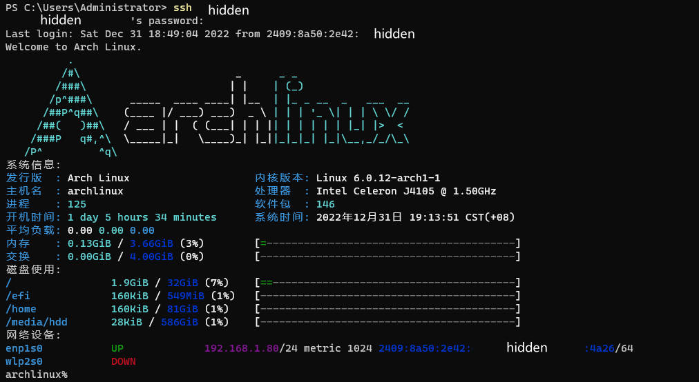

# dynamic-MOTD
Linux 动态 MOTD

让其他 Linux 发行版像 Ubuntu 一样登录之后显示系统信息。

## 效果图


## 使用方法
把 `motd.sh` 文件复制到 `/etc/profile/` 目录下即可。

## 一键安装
```shell
git clone https://github.com/yanxiangrong/dynamic-MOTD.git
cd dynamic-MOTD
sudo cp motd.sh /etc/profile/
```
